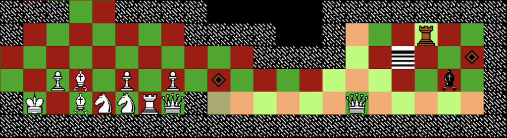

# *Chogue*

# [Play Online](https://www.pippinbarr.com/chogue/webgl/) (desktop only)

or

# Get it for [Android](https://play.google.com/store/apps/details?id=com.BarrLessard.Chogue), [iOS](https://apps.apple.com/app/chogue/id1464358271), [Mac](https://github.com/pippinbarr/chogue/releases/download/v1.0/chogue-mac.zip), or [Windows](https://github.com/pippinbarr/chogue/releases/download/v1.0/chogue-win.zip)

## Description

*Look! Up in the sky! It's a Chess Rogue-like! It's a Rogue Chess-like! No! It's Chogue! Faster than a Blitz Chess player who just drank a Potion of Haste! More powerful than than a Sicilian Dragon! Able to leap tall buildings in a single bound! It's the Chogue that refreshes!*

_Chogue_ is a hybrid game created out of two masterpieces, chess and _Rogue_, by [Jonathan Lessard](http://jonathanlessard.net/) and [Pippin Barr](http://pippinbarr.com/). Throughout its design and development we followed the (fairly) strict rule of making decisions that meant _Chogue_ corresponded either to chess or to _Rogue_ in each of its elements, from its spatial layout (_Rogue_) to its movement style (chess) to its combat system (chess) to its overall gameplay structure (_Rogue_). The result is a game that is as least as good as _Rogue_ and chess put together. If not better than that.

## Press
Read the [Desktop version press kit](https://github.com/pippinbarr/chogue/wiki/Press-Kit) or the [Mobile version press kit] (https://github.com/pippinbarr/chogue/wiki/Press-Kit-for-Mobile) for press information

## Process

* Read the [Process documentation wiki](https://github.com/pippinbarr/chogue/wiki) for process journal and correspondence between me and Jonathan
* Check out the [Process documentation folder](https://github.com/pippinbarr/chogue/tree/master/Process) in the repository for a grab-bag of other documentation elements
* Read the [Commit History](https://github.com/pippinbarr/chogue/commits/master) for step-by-step information about how the project was built
* Look at the [Code Repository](https://github.com/pippinbarr/chogue) for source code etc.

## License
_Chogue_ is an open source game licensed under a [Creative Commons Attribution-NonCommercial 3.0 Unported License](http://creativecommons.org/licenses/by-nc/3.0/). You can obtain the project files from its [code repository](https://github.com/pippinbarr/chogue) on GitHub.
